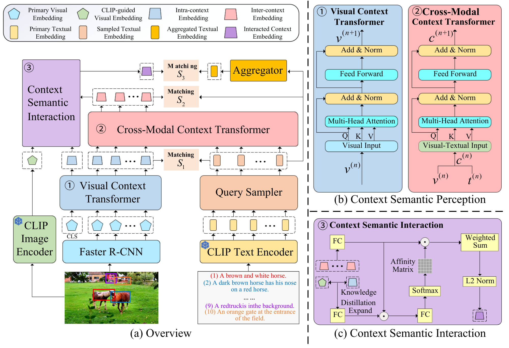

# About Me
Hi! I'm Zhihao, a first-year Ph.D. student at Western University. I'm fortunate to be co-supervised by [Prof. Boyu Wang](https://sites.google.com/site/borriewang/home) and [Prof. Charles Ling](https://www.csd.uwo.ca/~xling/). 

Before beginning my Ph.D., I earned my Master's degree from [Tianjin University](https://en.tju.edu.cn/) in 2024, where I focused my research on Cross-Modal Retrieval under the guidance of [Prof. Zhong Ji](https://faculty.tju.edu.cn/zhongJi/en/index.htm). Prior to this, I obtained my Bachelor's degree from [Shandong University](https://www.en.sdu.edu.cn) in 2021. 

# News
[2025.01]  Our paper "Visual Semantic Contextualization Network for Multi-Query Image Retrieval" has been accepted by _IEEE Transactions on Multimedia_. 

[2024.02]  Our paper "Hierarchical Matching and Reasoning for Multi-Query Image Retrieval" has been accepted by _Neural Networks_. 

# Selected Publications

    
    

        <strong>Hierarchical matching and reasoning for multi-query image retrieval</strong> 
        Zhong Ji, <strong>Zhihao Li, Yan Zhang, Haoran Wang, Yanwei Pang, Xuelong Li 
        <em>Neural Networks 2024</em> 
        <a href="https://www.sciencedirect.com/science/article/abs/pii/S0893608024001242">Paper</a> | <a href="https://github.com/zhli-cs/HMRN">Code</a>
    

    
    

        <strong>Visual Semantic Contextualization Network for Multi-Query Image Retrieval</strong> 
        Zhong Ji*, Zhihao Li*<strong>, Yan Zhang, Yanwei Pang, Xuelong Li 
        <em>IEEE Transactions on Multimedia</em> 
        <a href="https://ieeexplore.ieee.org/abstract/document/11086420">Paper</a> | <a href="https://github.com/zhli-cs/VSCN">Code</a>
    

